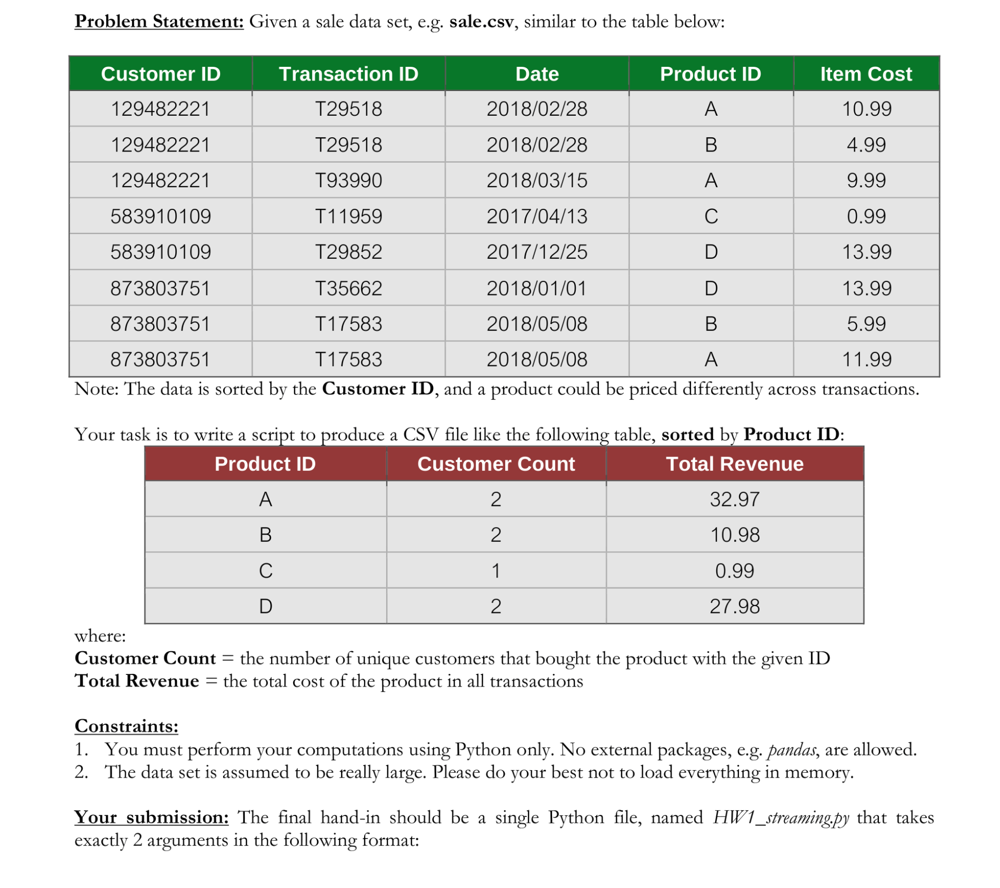

# Problem statement with Input Schema

 
## Instructions
- The entire homework is done using just core python library and nothing other than that.
- The ​ countminsketch.py ​ is a python file where count-min sketch data structure is constructed
and during its construction no other library but python core library is used.
- To run the ​ HW1_streaming.py​ file please include ​ countminsketch1.py ​ in the same directory
as ​ HW1_streaming.py ​ and then in command line
python ​ HW1_streaming.py ​ sale.csv output.csv
- References:
- 1)​ [Algorithm for count-min-sketch](http://dimacs.rutgers.edu/~graham/pubs/papers/cmsoft.pdf)
- 2)​ [Python implementation of count-min-sketch](https://github.com/barrust/count-min-sketch/blob/master/python/countminsketch.py)
